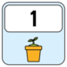
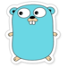
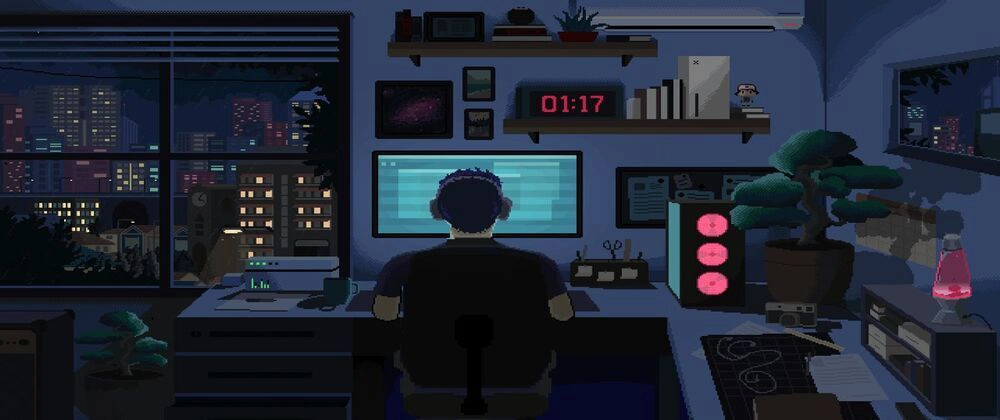
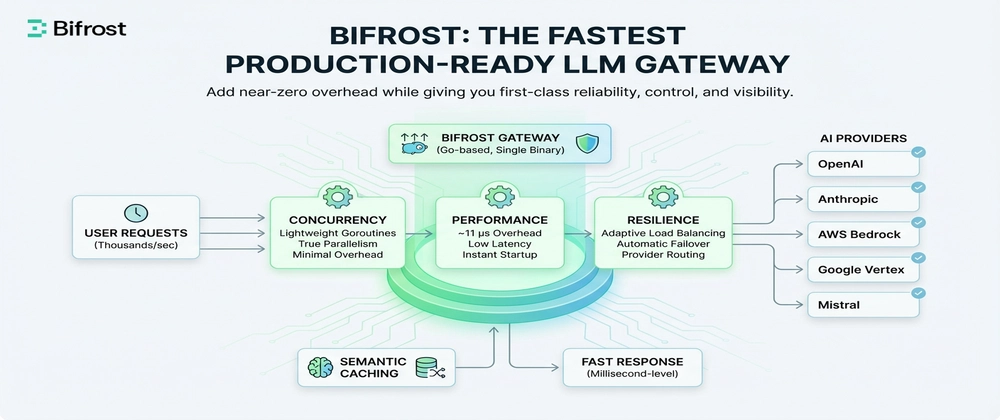

 

<h1 align="center">
    
</h1>

<h3 align="center">A passionate Software Engineer</h3>
 

  
  
  
  
  
  
  

 
 

- 🔭 I’m currently: **Freelancing** 

- 🌱 I’m currently learning: **Data structures & Algorithms** 

- 📝 I regularly write articles on: **<a href="https://dev.to/hadil">Dev.to</a>** 

- 📫 How to reach me: **hadilbenabdallah111@gmail.com** 

- ⚡ Fun fact: **I want to travel to Switzerland** 
 

 

<h2 align="center">🏆 Trophies 🏆</h2>
 

  

 

<!-- MultiLanguage, -->
 <h2 align="center">🥇 LeetCode Badges 🥇</h2>
 

 
    
    
    
    
    
    
    
    
    
    
    
    
    
    
    
    
     
    
    
    
    
    
    
    
    
    
    
    
    

 

 <h2 align="center">✍🏻 Dev Community Badges ✍🏻</h2>
  

 
    
    
    
    
    
    
    
    
    
    
     
    
    
    
    
    
    
    
    
    
    

> Some of my blogs I'm proud of

|  Banner  |   Details  |
|:--------:|:-----------|
|  | ✧  Reached 20k+ views and 250+ reactions   ✧ Got me the "CodeNewbie" badge    [Coding Without Pressure: How Slowing Down Helped Me Learn Faster](https://dev.to/hadil/coding-without-pressure-how-slowing-down-helped-me-learn-faster-lko) |
|  | ✧ Reached 10k+ views   ✧ Got me the "Git" badge    [The 15 Git Commands Every Software Engineer Uses (And Why They Matter More Than You Think)](https://dev.to/hadil/the-15-git-commands-every-software-engineer-uses-and-why-they-matter-more-than-you-think-c51) |
|  | ✧ Got me the "Go" badge    [Bifrost: The Fastest LLM Gateway for Production-Ready AI Systems (40x Faster Than LiteLLM)](https://dev.to/hadil/bifrost-the-fastest-llm-gateway-for-production-ready-ai-systems-40x-faster-than-litellm-2i51) |
|  | ✧ Reached 10k+ views   ✧ Got me the "React" badge    [🦊 React-Fox-Toast: A Silent but Powerful Presence in Your UI](https://dev.to/hadil/react-fox-toast-a-silent-but-powerful-presence-in-your-ui-4k9c) |
|  | ✧ Reached 15k+ views    [🚀 5 VSCode Extensions That Will Make You Actually Enjoy Coding Again 🎉](https://dev.to/hadil/5-vscode-extensions-that-will-make-you-actually-enjoy-coding-again-372n) |

 

<h2 align="center">📞 Connect with me 📞</h2>
 

  
 

     

 

<h2 align="center">⚔ Languages-Frameworks-Tools ⚔</h2>
 

<table>

<table align="center">
  <tr>
    <td align="center" width="96">
        
    </td>
    <td align="center" width="96">
        
    </td>
    <td align="center" width="96">
        
    </td>
      <td align="center" width="96">
        
    </td>
    <td align="center" width="96">
        
    </td>
    <td align="center" width="96">
        
    </td>
    <td align="center" width="96">
        
    </td>
      <td align="center" width="96">
        
    </td>
  </tr>
  <tr>    
<td align="center" width="96"> 
        
    </td>
     <td align="center" width="96">
        
    </td>
<td align="center"  width="96">
        
    </td>
<td align="center" width="96">
        
    </td>
<td align="center"  width="96">
        
    </td>
<td align="center"  width="96">
        
    </td>
    <td align="center"  width="96">
        
    </td>
   <td align="center" width="96">
        
    </td>
  </tr>
 <tr>     
<td align="center" width="96">
        
    </td>
<td align="center" width="96">
        
    </td>
<td align="center" width="96">
        
    </td>
<td align="center" width="96">
        
    </td>
<td align="center" width="96">
        
    </td>
<td align="center" width="96">
        
    </td>
<td align="center" width="96">
        
    </td>
    <td align="center" width="96">
        
     </td>
 </tr>
</table>
</table>

 
 

<h2 align="center">⚡ Stats ⚡</h2>
 

  
   
   
 
 
    
  
    
 

 

  

 

<h2 align="center">🎮 Interests 🎮</h2>
 

 
 
 

    

<h4 align="center">Made with  by Hadil</h4>

  

